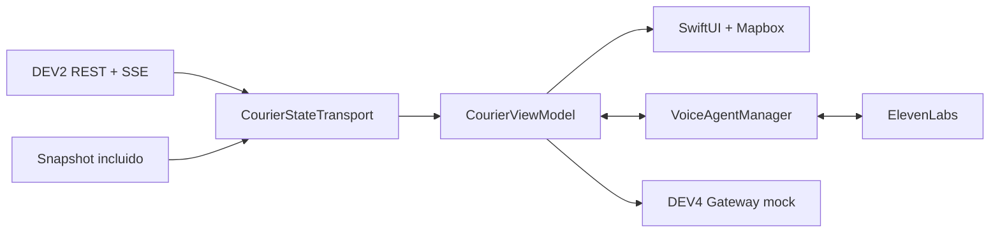

# CourierApp

Aplicación iOS para visualizar y acompañar la operación de un courier en tiempo real. Muestra su posición y ruta en Mapbox, consume el estado de una simulación por Server-Sent Events (SSE) y ofrece un asistente de voz conectado a ElevenLabs.

## Funcionalidades

- Seguimiento del courier sobre un mapa con cámara automática y orientación de movimiento.
- Visualización de la ruta pendiente, pickup, entrega y calles cerradas.
- Métricas de ganancias, pedidos activos y entregas completadas.
- Indicadores de clima, tarifa dinámica y estado de conexión.
- Actualización en tiempo real desde DEV2 mediante SSE, con reconexión y backoff automático.
- Modo demo local cuando no se configura un servidor DEV2.
- Agente de voz en español para consultar el estado y controlar la simulación.
- Anuncio automático cuando el agente acepta un nuevo viaje.

## Tecnologías

- Swift y SwiftUI
- Mapbox Maps SDK `11.30.1`
- ElevenLabs Swift SDK `3.3.1`
- Swift Concurrency (`async`/`await`, `AsyncThrowingStream`)
- Server-Sent Events (SSE)
- Swift Package Manager

## Requisitos

- macOS con Xcode 26.6 o posterior.
- Un simulador o dispositivo con iOS/iPadOS 26.5 o posterior, de acuerdo con el deployment target actual.
- Un token público de [Mapbox](https://account.mapbox.com/access-tokens/).
- Opcional: un agente de [ElevenLabs](https://elevenlabs.io/) para habilitar la conversación por voz.
- Opcional: una instancia de DEV2 accesible desde el dispositivo para recibir datos en vivo.

## Instalación

1. Clona el repositorio y entra al proyecto iOS:

   ```bash
   git clone https://github.com/A01754754/ysisidro-infoys-app.git
   cd ysidro-infoys-app/CourierApp
   ```

2. Crea el archivo de configuración local:

   ```bash
   cp Config/Secrets.example.xcconfig Config/Secrets.xcconfig
   ```

3. Edita `Config/Secrets.xcconfig`:

   ```xcconfig
   MBX_ACCESS_TOKEN = TU_TOKEN_PUBLICO_DE_MAPBOX
   ELEVENLABS_AGENT_ID = TU_AGENT_ID_DE_ELEVENLABS
   DEV2_BASE_URL = http:/$()/localhost:3000
   ```

   `MBX_ACCESS_TOKEN` es necesario para cargar el mapa. `ELEVENLABS_AGENT_ID` y `DEV2_BASE_URL` son opcionales. La forma `http:/$()/...` evita que `//` se interprete como un comentario dentro de un archivo `.xcconfig`.

4. Abre `CourierApp.xcodeproj` en Xcode. Swift Package Manager resolverá Mapbox, ElevenLabs y sus dependencias automáticamente.

5. Selecciona el esquema `CorierApp`, elige un simulador o dispositivo y ejecuta con `⌘R`.

> `Config/Secrets.xcconfig` está ignorado por Git. No agregues credenciales directamente a `App.xcconfig`, `Info.plist` ni al código fuente.

## Modos de datos

### Demo local

Deja `DEV2_BASE_URL` vacío para usar `CourierApp/Resources/dev2-courier-state.json`. La app carga un snapshot incluido en el bundle y simula una decisión de aceptación, por lo que puede probarse sin levantar el backend.

### DEV2 en vivo

Al configurar `DEV2_BASE_URL`, la app usa los siguientes endpoints:

| Método | Endpoint | Uso |
| --- | --- | --- |
| `GET` | `/simulation/state` | Obtiene el snapshot completo de la simulación. |
| `GET` | `/events` | Mantiene el stream SSE de actualizaciones. |

El stream reconoce eventos como `simulation_snapshot`, `courier_positions`, `agent_decision_applied`, `agent_decision_failed`, `courier_waiting_agent` y `agent_request_sent`. Los cambios de pedidos, rutas, clima, calles o ciclo de la simulación provocan una actualización del snapshot.

Si DEV2 corre en la misma Mac que el simulador, `localhost` suele ser suficiente. Desde un iPhone físico debes usar una dirección de red accesible para el dispositivo. La app declara acceso a la red local en `Info.plist`.

## Configuración del agente de voz

El agente habla en español y recibe contexto del courier y del viaje aceptado. Para que también pueda controlar la app, configura estas herramientas como **Client Tools** en ElevenLabs:

| Herramienta | Parámetros | Acción |
| --- | --- | --- |
| `get_courier_state` | Ninguno | Devuelve el estado actual del courier, ruta, pedido, ganancias y entorno. |
| `pause_simulation` | Ninguno | Pausa el procesamiento de eventos. |
| `resume_simulation` | Ninguno | Reanuda el procesamiento. |
| `set_playback_speed` | `speed`: número | Cambia la velocidad a `1`, `5` o `20`. |

La aplicación solicita permiso de micrófono al iniciar una conversación y comienza con el micrófono activo. Usa el control del micrófono en pantalla para silenciarlo o volverlo a activar.

## Arquitectura



```text
CourierApp/
├── Config/                         # Configuración compartida y plantilla local
├── CourierApp/
│   ├── Models/                     # Modelos de DEV2, eventos y contexto de voz
│   ├── Resources/                  # Snapshots y eventos de demostración
│   ├── Transport/                  # SSE, datos locales y gateway de DEV4
│   ├── ViewModels/                 # Estado de la simulación y agente de voz
│   ├── Views/                      # Mapa, tarjetas, controles e indicadores
│   ├── AppConfiguration.swift      # Lectura segura de valores de Info.plist
│   └── CourierAppApp.swift         # Punto de entrada de la aplicación
└── CourierApp.xcodeproj/           # Proyecto de Xcode y dependencias SPM
```

`CourierViewModel` concentra el estado observable y traduce los mensajes externos a datos de interfaz. Las implementaciones de `CourierStateTransport` permiten alternar entre SSE y el snapshot local sin cambiar las vistas. `VoiceAgentManager` mantiene la conversación y responde las llamadas de herramientas del agente.

## Estado de las integraciones

- **DEV2:** implementado mediante REST + SSE y disponible también en modo demo.
- **ElevenLabs:** implementado; requiere un `ELEVENLABS_AGENT_ID` y las Client Tools descritas arriba.
- **DEV4:** actualmente usa `MockDev4GatewayClient`; al detectar una llegada imprime el comando `WAYPOINT_REACHED` en la consola de Xcode, pero todavía no realiza una petición de red real.

## Solución de problemas

- **El mapa no aparece:** verifica `MBX_ACCESS_TOKEN` y vuelve a compilar la app.
- **“Falta configurar el agente”:** agrega un `ELEVENLABS_AGENT_ID` válido en `Secrets.xcconfig`.
- **DEV2 se reconecta continuamente:** comprueba la URL, que `/events` responda con `text/event-stream` y que el dispositivo pueda alcanzar el servidor.
- **No hay acceso al backend desde un dispositivo físico:** sustituye `localhost` por la IP local de la Mac y acepta el permiso de red local.
- **Las dependencias no cargan:** en Xcode usa **File > Packages > Reset Package Caches** y vuelve a resolver los paquetes.

## Notas de desarrollo

- El target y el esquema se llaman actualmente `CorierApp` (con una sola “u”), aunque la carpeta y este documento usan `CourierApp`.
- El proyecto todavía no incluye un target de pruebas automatizadas.
- Los archivos de demo permiten desarrollar la interfaz sin depender de servicios externos.
